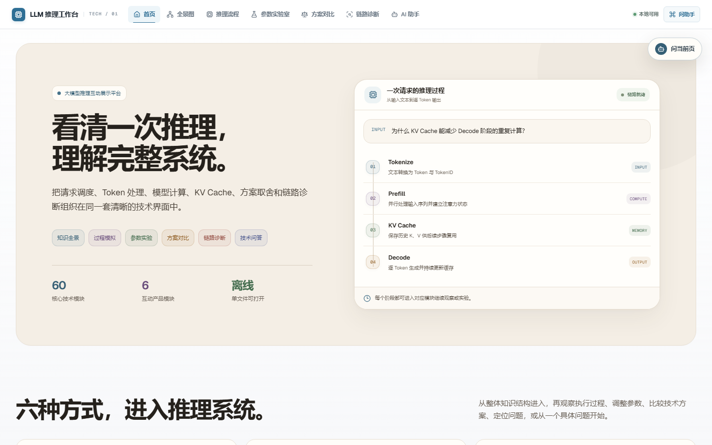
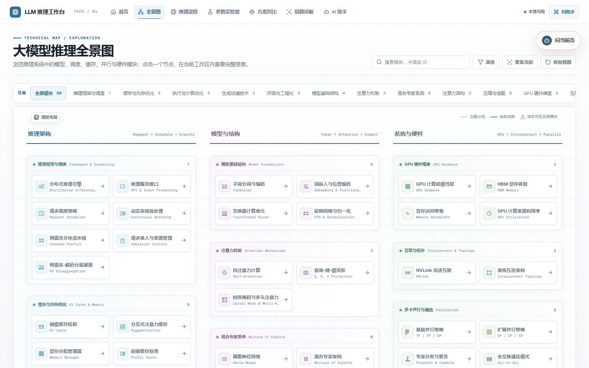
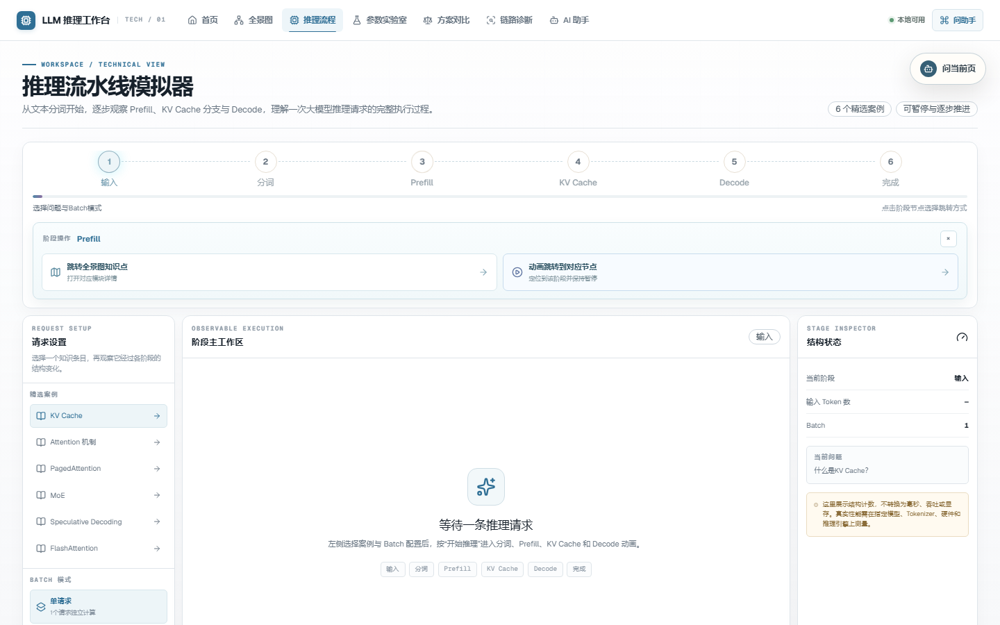
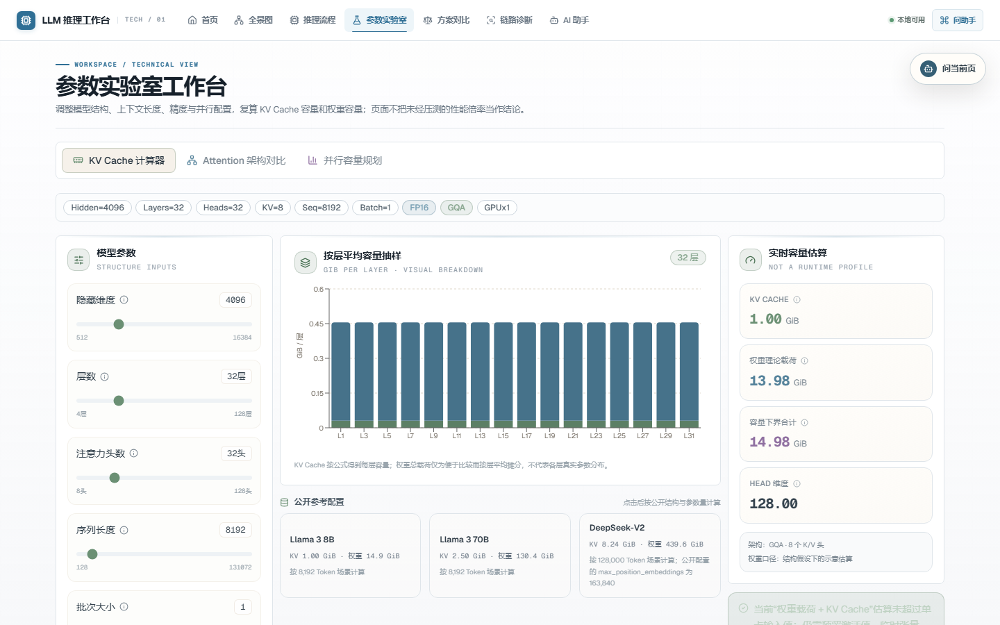
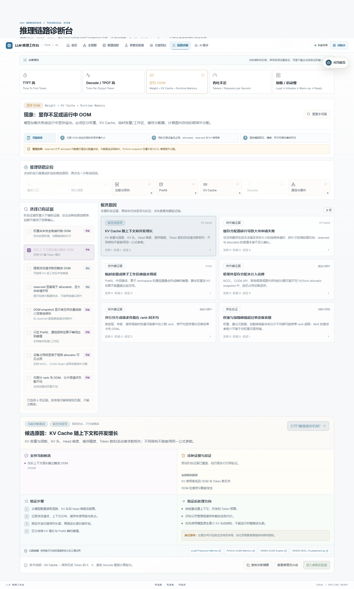

# LLM 推理工作台

面向大模型推理系统的交互式技术工作台，集成技术全景图、推理流程动画、参数实验、方案对比、硬件容量规划、证据驱动诊断、上下文 AI 问答与 PPT 导出。

在线演示：[https://llm-inference-platform-pisc2.vercel.app](https://llm-inference-platform-pisc2.vercel.app)

> 本项目用于解释机制、复算容量和组织诊断证据。页面中的结构动画、公式结果与参考配置不等同于真实性能测试；涉及延迟、吞吐、显存峰值或硬件结论时，仍需补齐模型、负载、精度、拓扑、软件版本和测试方法。

## 功能概览

| 模块 | 主要能力 |
| --- | --- |
| 首页 | 汇总推理链路、技术主题、实验入口、方案对比、硬件规划、诊断与 AI 助手 |
| 推理技术全景图 | 展示 60 个推理技术模块，支持搜索、主题筛选、模块详情、关联知识跳转 |
| 推理流水线 | 动画演示输入、分词、Prefill、KV Cache、Decode 与完成阶段，支持暂停、单步和阶段跳转 |
| 参数实验室 | 提供 KV Cache 计算、Attention 架构对比与并行容量规划，包含 MHA、GQA、MQA、MLA 以及 FP16、INT8、INT4 |
| 技术方案对比 | 比较调度与组批、Dense 与 MoE、权重量化三类方案的机制、优势、局限和适用条件 |
| 硬件容量计算器 | 根据大模型权重、小模型、智能体、服务缓存、KV Cache、峰值负载和图片存储，自动推荐 GB10、T5000、RTX6000D 搭配 |
| 推理链路诊断 | 覆盖 TTFT、TPOT、OOM、吞吐与启动问题，包含 40 项证据、30 个候选原因、反证、验证步骤与处理方向 |
| AI 技术问答 | 结合当前页面上下文和 80 条知识条目回答问题，支持在线模型、离线知识降级、来源与跨模块跳转 |
| PPT 导出 | 将回答或页面上下文整理为演示大纲并生成 PPTX，保留来源、边界和演讲备注 |

## 设计与交互特点

- Light Technical Workbench 浅色技术工作台界面。
- 固定全景图网格与居中模块详情窗口。
- 推理流程包含可暂停、可单步的阶段动画。
- 参数结果明确区分公式计算、理论容量与真实性能测量。
- 硬件计算器采用“输入工作负载 → 计算峰值与余量 → 输出存储和硬件”的纵向工作流，输入与输出不混在同一排。
- 硬件推荐不要求用户预选设备，会自动枚举 GB10、T5000、RTX6000D，并区分保守可行方案与仅原始容量覆盖的边界方案。
- 诊断遵循“现象 → 证据 → 候选原因 → 反证 → 验证路径 → 处理方向”。
- 全局页面上下文可供 AI 助手和 PPT 导出复用。
- 使用 `HashRouter` 与单文件构建，可直接打开 `dist/index.html` 浏览离线功能。

## 界面演示

以下截图来自当前版本的正式页面，展示平台的主要工作区与交互方向。页面中的动画、筛选、参数调整、证据选择和模块跳转需要在浏览器中运行项目后体验。

<p align="center">
  
  
</p>

<p align="center">
  
  
</p>

<p align="center">
  
</p>

## 技术栈

- React 19
- Vite 8
- React Router
- Tailwind CSS 4
- Framer Motion
- Recharts
- Lucide React
- PptxGenJS
- Node.js HTTP API
- OpenAI-compatible Chat Completions

## 环境要求

- Node.js `^20.19.0` 或 `>=22.12.0`
- npm
- 可选：OpenAI-compatible 模型服务
- 可选：PPT 渲染运行时

## 快速开始

### 1. 安装依赖

```bash
npm ci
```

### 2. 启动前端

```bash
npm run dev
```

默认访问地址通常为：

```text
http://127.0.0.1:5173/
```

### 3. 启动 AI 与 PPT API

另开一个终端：

```bash
npm run agent:dev
```

默认 API 地址：

```text
http://127.0.0.1:8787
```

如果不启动 API，主要页面和本地知识问答仍可使用；在线模型、会话模型配置和服务端 PPTX 渲染不可用。

### 直接打开 `dist/index.html`（file://）时接入 API

单文件构建也支持在线模型：先启动本地 API（`npm start`，默认 `http://127.0.0.1:8787`），再用浏览器直接打开
`dist/index.html`。此时 AI 技术问答、模型配置窗口和 PPT 导出都会调用本地服务，无需额外配置。

- 服务端密钥：把 `LLM_API_BASE_URL`、`LLM_API_KEY`、`LLM_MODEL` 写入 `.env`，重启 `npm start` 即作为默认模型。
- 会话密钥：在 AI 技术问答页点击「配置模型」，填写你自己的 API Key、服务地址和模型名称，保存后按会话生效。
- 本地服务端默认放行 `file://` 页面（`Origin: null`）；托管部署（Vercel / Render）如需同样行为，设置 `AGENT_ALLOW_FILE_ORIGIN=true`。

## 环境变量

复制示例配置：

```powershell
Copy-Item .env.example .env
```

Linux 或 macOS：

```bash
cp .env.example .env
```

主要变量：

```env
LLM_API_BASE_URL=
LLM_API_KEY=
LLM_MODEL=
LLM_PROVIDER=openai-compatible

LLM_TEMPERATURE=0.2
LLM_MAX_TOKENS=1200
LLM_TIMEOUT_MS=60000

AGENT_ALLOWED_ORIGIN=
MODEL_CONFIG_SECRET=
AGENT_DEV_HOST=127.0.0.1
AGENT_DEV_PORT=8787
VITE_AGENT_API_URL=
```

注意：

- 不要把真实 API Key 写入 `VITE_*` 变量；`VITE_*` 会进入浏览器构建产物。
- `.env` 已被 Git 忽略，`.env.example` 只保留无密钥示例。
- 用户在模型配置窗口保存的配置按会话 Token 隔离，并优先于部署默认配置。
- Serverless 部署应设置至少 32 个随机字符的 `MODEL_CONFIG_SECRET`；自定义模型配置会以 AES-256-GCM 加密令牌在函数之间传递，12 小时后失效。
- 共享默认模型可通过 `AGENT_RATE_LIMIT_*` 变量配置请求和每日额度保护。

## 模型回答模式

平台按以下顺序工作：

1. 当前会话配置的 OpenAI-compatible 模型。
2. 部署环境中的默认模型配置。
3. 本地知识库离线回答。

在线模型失败、超时、返回限流或未配置时，系统会降级到本地知识回答，避免阻断核心使用流程。

## PPT 导出

PPT 流程包含：

```text
当前页面或最近回答
  → PresentationSpec 大纲
  → 服务端 PPT 渲染
  → 浏览器下载 PPTX
```

PPTX 由服务端使用 PptxGenJS 在内存中生成，不依赖 Codex 本机运行时、Office 或 LibreOffice。Vercel Node.js Function 与本地 Node API 均可执行该流程。仅部署静态 `dist` 时仍无法调用服务端 PPTX 接口。

## 构建与离线运行

```bash
npm run build
```

硬件容量计算器的核心公式可以单独回归测试：

```bash
node scripts/test-hardware-calculator.mjs
```

构建输出：

```text
dist/index.html
```

项目使用：

- `base: './'`
- `HashRouter`
- `vite-plugin-singlefile`

因此 `dist/index.html` 是包含主要脚本和样式的单文件构建，可以直接打开使用离线页面功能；需要在线 AI 问答时，
先运行 `npm start` 启动本地 API（见上文「直接打开 `dist/index.html`（file://）时接入 API」）。

仓库同时保留独立的 `dist/hardware-calculator-mvp.html`，用于不启动 React 工作台时快速验证硬件计算器的输入输出。

## 路由

| 路由 | 页面 |
| --- | --- |
| `#/` | 首页 |
| `#/panorama` | 推理技术全景图 |
| `#/pipeline` | 推理流水线 |
| `#/lab` | 参数实验室 |
| `#/compare` | 技术方案对比 |
| `#/hardware` | 硬件容量计算器 |
| `#/diagnosis` | 推理链路诊断 |
| `#/detective` | 兼容路由，跳转到链路诊断 |
| `#/agent` | AI 技术问答 |

## 项目结构

```text
llm-inference-platform/
├─ api/                    # AI、模型配置与 PPT HTTP 入口
├─ server/                 # 检索、模型适配、限流和 PPT 服务
├─ skills/                 # knowledge-to-ppt 技能与渲染脚本
├─ src/
│  ├─ components/         # 共享布局、助手、配置和导出组件
│  ├─ context/            # 页面上下文、会话、模型和 PPT 状态
│  ├─ data/               # 全景图、知识库和诊断数据
│  ├─ modules/            # 参数实验和 AI 客户端逻辑
│  └─ pages/              # 八个正式页面
├─ docs/                   # 改版、数据严谨性与验收文档
├─ .env.example
├─ vite.config.js
└─ package.json
```

## 数据与结论边界

- 全景图模块和知识条目使用稳定 ID，供页面跳转、上下文注册和助手检索复用。
- KV Cache 与权重结果是基于当前输入的理论载荷或容量下界，不包含全部运行时开销。
- 硬件容量计算器的默认估算包含 1.3× 峰值负载系数、10% 运行时预留、1.5× 模型存储暂存系数、15% 图片附属空间和 70% 存储目标占用率；这些是规划口径，不替代压测。
- 硬件推荐使用设备保守可用容量筛选。GB10、T5000 的 128GB 统一内存与 RTX6000D 的 84GB 显存不能仅按数字相加判断性能；异构组合仍需确认模型并行、通信拓扑和推理框架支持。
- 图片存储按每日数量、保留天数和单张大小计算，并额外考虑缩略图、元数据等附属空间；模型暂存系数用于覆盖下载、升级时新旧版本共存。
- 量化位宽不能直接推导同等比例的性能收益或精度损失。
- GPU 利用率、显存占用和通信占比必须与有效吞吐、延迟及完整测试条件联合解释。
- 诊断候选排序是可解释的规则匹配，不是统计概率，也不宣布未经验证的唯一根因。

详细审计见：

- `docs/数据严谨性审计-20260820.md`
- `docs/成品终验报告-20260820.md`
- `docs/免费默认模型与自定义API方案.md`

## 部署状态

当前仓库已支持：

- 本地 Vite 开发
- 本地 Node API
- 单文件静态构建
- `file://` 离线打开
- Vercel 静态前端与 Node.js Functions
- Render 免费 Node Web Service（前端、AI API 与 PPTX API 同源运行）
- 云端 PPTX 内存渲染

推荐部署方式：如果访问网络能够稳定连接 Vercel，可使用 Vercel 的 `npm run build` 和 `dist` 输出目录；如果 `vercel.app` 在所在网络不可访问，可使用 Render Web Service，配置已写入 `render.yaml`。

Render 配置：

- Build Command：`npm ci && npm run build`
- Start Command：`npm start`
- Health Check：`/`
- 免费实例会在空闲约 15 分钟后休眠，首次请求可能需要等待实例唤醒。

在线模型密钥只填写到部署平台的服务端环境变量；不要创建任何包含密钥的 `VITE_*` 变量。部署环境不设置 `VITE_AGENT_API_URL` 时，前端会自动调用同域 `/api`。Render 和 Vercel 都支持当前 Node API 与 PPTX 服务；仅部署静态 `dist` 时仍无法调用服务端接口。

## 安全说明

- 不提交 `.env`、API Key、访问令牌或本机运行时路径。
- 公开部署前必须限制 CORS 和模型服务目标地址。
- 公开环境默认拒绝 HTTP、localhost、私有网段、链路本地地址和云元数据地址。
- 公共默认模型需要单 IP 和共享总额度限制。
- 多实例部署时，内存限流需要迁移到共享 KV、Redis 或同类存储。
- 公开的自定义 API 配置必须防止 SSRF、私有网络访问和云元数据访问。

## License

当前仓库未附带开源许可证。在添加 License 前，默认不授予他人复制、修改、分发或再授权本项目的权利。

如果计划公开开源：

- 希望允许广泛复用：可选择 MIT License。
- 希望增加明确的专利授权条款：可选择 Apache License 2.0。
- 仅公开展示源码、不允许复用：暂不添加开源 License，并在仓库说明中保留所有权利。
